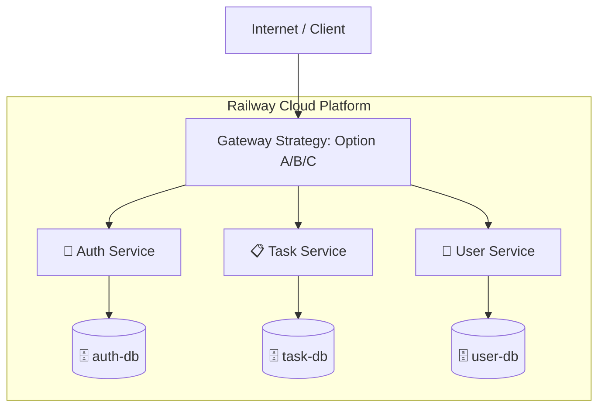

# ENGCE301 Software Design and Development - Final Lab ชุดที่ 2

## 1. ชื่อโครงงาน
Microservices Scale-Up + Cloud Deploy (Railway)

## 2. สมาชิกกลุ่ม
1. [นายสรภูริ์  ทองจันทร์] [67543206078-7]
2. [นายเกียรติศักดิ์   อุปพรม] [67543206002-7]

## 3. ภาพรวมระบบ
ระบบเป็นการขยายสถาปัตยกรรม Microservices จาก 2 services เป็น 3 services (Auth, Task, User) โดยใช้รูปแบบ **Database-per-Service Pattern** (แยก Database อิสระต่อกัน) และทำการ Deploy ขึ้นบน **Railway Cloud**

## 4. Architecture Overview


## 5. Auth Service
- **URL:** [ระบุ URL บน Railway เช่น https://auth-service.up.railway.app]
- **Port:** 3001
- **หน้าที่:** จัดการการลงทะเบียน (Register), การเข้าสู่ระบบ (Login) และการออก JWT Token นอกจากนี้ยังทำหน้าที่เก็บ Logs เฉพาะส่วนของ Auth ลงใน Database ของตัวเอง

## 6. Task Service
- **URL:** [ระบุ URL บน Railway เช่น https://task-service.up.railway.app]
- **Port:** 3002
- **หน้าที่:** จัดการข้อมูลงาน (Tasks) ของผู้ใช้แต่ละคน โดยต้องใช้ JWT Token ในการยืนยันตัวตน มีการบันทึก Logs การทำงานลงใน Database ของตัวเอง

## 7. Database Design (Set 2: 3 DB)
ระบบใช้ Database PostgreSQL 3 ชุด แยกตาม Service:
1. **auth-db:** ตาราง `users` (id, username, password_hash, email) และ `logs`
2. **task-db:** ตาราง `tasks` (id, user_id, title, description, status) และ `logs`
3. **user-db:** ตาราง `user_profiles` (id, user_id, display_name, bio, avatar_url) และ `logs`
*ไม่มีการใช้ Foreign Key ข้าม Database แต่ใช้ `user_id` เป็น Conceptual Link*

## 8. Nginx HTTPS Gateway / Gateway Strategy
**Strategy:** [ระบุ Option ที่เลือก เช่น Option A: Direct Access หรือ Option B: Nginx Gateway]
**เหตุผล:** [ระบุเหตุผล เช่น เพื่อความเรียบง่ายในการทดสอบ หรือ เพื่อความเป็นระเบียบและ Single Entry Point]

## 9. JWT Authentication Flow
1. ผู้ใช้ Login ผ่าน Auth Service ได้รับ JWT Token
2. ผู้ใช้แนบ Token ใน Header `Authorization: Bearer <token>` เมื่อเรียก Task Service หรือ User Service
3. Service ปลายทางตรวจสอบ Token ด้วย `JWT_SECRET` ที่ตรงกันทุก Service เพื่ออนุญาตการเข้าถึง

## 10. Basic Activity Log Integration
แต่ละ Service (Auth, Task, User) มีตาราง `logs` ใน Database ของตัวเอง เพื่อเก็บประวัติการทำรายการภายใน Service นั้นๆ ตามหลักการบำรุงรักษาแบบแยกส่วน (Isolation)

## 11. Frontend Main App
เว็บแอปพลิเคชันสำหรับจัดการงาน (Task Management) เชื่อมต่อกับ Backend ผ่าน API Endpoints บน Cloud

## 12. Frontend Log Viewer
หน้าจอสำหรับดู Activity Logs ของระบบ (แยกตาม Service)

## 13. วิธี run ระบบ
### Local (Docker Compose)
```bash
docker-compose up --build
```
### Cloud (Railway)
ทุก Service ถูก Deploy ผ่าน GitHub และตั้งค่า Environment Variables บน Railway Dashboard

## 14. Environment Variables
- `DATABASE_URL`: URL สำหรับเชื่อมต่อ Database ของแต่ละ Service
- `JWT_SECRET`: Shared secret สำหรับการออกและตรวจสอบ Token (ต้องตรงกันทุก Service)
- `PORT`: พอร์ตที่ Service รัน (3001, 3002, 3003)
- `AUTH_SERVICE_URL`: URL ของ Auth Service สำหรับการตรวจสอบ JWT หรือสื่อสารระหว่าง Service

## 15. Sample Endpoints
- **Auth:** `POST /api/auth/register`, `POST /api/auth/login`
- **Task:** `GET /api/tasks`, `POST /api/tasks` (Require JWT)
- **User:** `GET /api/users/profile`, `PUT /api/users/profile` (Require JWT)

## 16. วิธีทดสอบ
ใช้คำสั่ง `curl` หรือ Postman โดยส่ง JWT Token ใน Header:
```bash
curl -H "Authorization: Bearer <TOKEN>" https://[TASK_URL]/api/tasks
```

## 17. หลักฐานใน docs/
- [ ] DB Schema Design
- [ ] API Specification
- [ ] Architecture Diagram

## 18. ปัญหาที่พบและวิธีแก้
- **ปัญหา:** `npm ci` ล้มเหลวระหว่าง Deploy บน Railway เนื่องจากขาด `package-lock.json`
- **วิธีแก้:** รัน `npm install --package-lock-only` เพื่อสร้าง lockfile และ push ขึ้น GitHub ใหม่

## 19. สิ่งที่ยังไม่สมบูรณ์
- [ ] การเชื่อมต่อ UI หน้า Profile ให้สมบูรณ์ 100%
- [ ] ระบบ Refresh Token